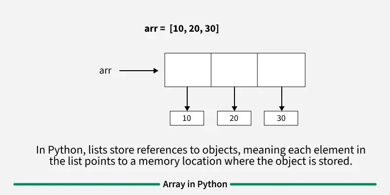
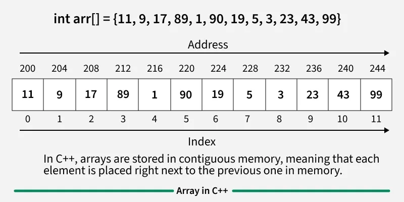
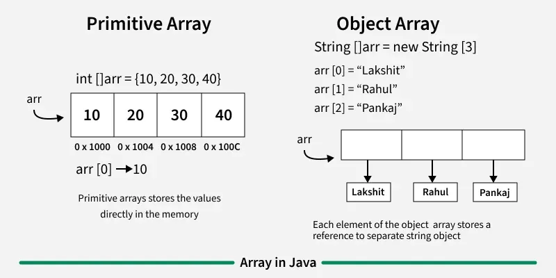
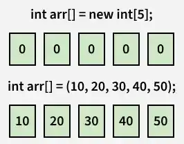

# Arrays Theory

## Introduction
Arrays are fundamental data structures in computer science and programming.

- **Linear data structure**:  Its called linear data strucrure because its elements are arranged in a sequence, one after another, at contigious location in memory.
    - In c/c++ and java primitive array elements are stored at contigious location in memory. 
    - For dynamic array in c/c++ we use vector and in java we use ArrayList
    - In case of Python, JS, Java Non-Primitive, references are stored at contigious location.
- **Same Variable Type**: Array store elements of same data type at contigious location.
- **Array Element**: Elements are items stored in an array.
- **Array Index**: Elements are accessed by their indexes. Index in most programming language by default start from 0.

- **Memory Representation**: All elements or their references are stored in contigious location in memory. This allow efficient access and manipulation of elements.
    - 
    - 
    - 
- **Declaration**:
    - **Java**: 
        - int arr[]; This array will store integer type elements.
        - char arr[]: This array will srore char type elements.
        - float arr[]: This will store float type
        - Above are primitive array as they store element of primitive types. 
    - **Python**:
        - arr = [] All kind of lists are declared same

- **Initialization**:
    - **Java**:
        - int arr[]= {1,2,4,5}
    - **Python**:
        - arr = [1,2,4,5]
        - arr = ['a','b']

- **Why do we need Array?**:
    - Assume we have to store marks of students, lets say initially we have 5 students, we can store there marks in 5 differen variables like 
        - int ravi= 44l
        - int shyam=33
        - int Akash=44
        - int raman=44
        - int radha=343
    Now what if students increases from 5 to 500, we cannot keep storing then in different variable, because accessing them will be difficult.
    So we use array of students.
    - Storing individual values in standalone variables work fine for a handful of items only - byt it does nto scale.
    - If we need 100 no, writing n1,n2,n3 is tedious and error-prone.
    - An array lets you declare once and access with indices 
    a[0] a[1]..........a[99]
    - Uniform operation: we can loop over an array and apply the same logic to all elemts.
    - With individual variables u have to repeat the code for each one.
    - Array occupies contigious memory, so indexing is constant time O1
    - Seperate variables may reside anywhere, and mapping them collectively is hard.
    - Many alog sorting, searching assumer a sequence you can iterate, Array provides that sequence naturally
    - variables are good for single value, arrays are the tool for handling collections efficiently and elegantly.

- **Types**:
    - Fixed Size: Can't alter or update the size of array once declared. 
        - int[] a= new int[5];
        - int[] a= new int {1,2,3,45,5};  
    - Dynamic Size:Size changes as per user requirements during execution. We can add or remvoe the elements. Memory is dynamically allocated and deallocated at runtime.
        - ArrayList<Integer> a=  new ArrayList<>();

    - One-Dimensional: image it as a row.
    - Multi-Dimensional: 
        -  2D Array: Arrays or Arays
        - 3D Arrays: Array of 2D Arrays.
    

- **Advantages**: 
    - **Random Access**: 
        -  Array is mainly used when we need fast random access to elements.
        - Since it stores fixed size elements in sequence one can compute address of ith element in O(1) time.
        - BaseAddress + ( i )* size= Address of ith element.
    - **Cache Friendly**:
        - Since elements are stored at contigious location accessing them take advantage of cache hit , called locality of reference.
- **Disadvantages**:
    - Array is not useful in places where we have operations like insert in middle, delete from middle, search in unsored data. 
    - Since if we insert in middle, we need to shift all other elements by 1 in right.
    - Same for deletion we need to shift all element left by 1, which is o(n) in worst case.

## Key Concepts

- **Definition**: A collection of elements stored in contiguous memory locations
- **Indexing**: Elements accessed by their position (0-based in most languages)
- **Fixed Size**: Traditional arrays have a predetermined length
- **Homogeneous**: All elements typically share the same data type

## Basic Operations

- **Access**: O(1) - direct access via index
- **Search**: O(n) - linear search through elements
- **Insert**: O(n) - may require shifting elements
- **Delete**: O(n) - may require shifting elements

## Advantages

- Fast random access to elements, 
- Memory efficient with contiguous allocation
- Simple implementation and understanding

## Disadvantages

- Fixed size limitations, Expanding an array requires creating a new one and copying elements from old one which is time-consuming and memory-intensive. Even dynamic sized aarray internally uses fixed size memory allocation and deallocation,

- Expensive insertions and deletions , Adding removing random elements require shifting subsequent elements, making operation inefficient.
- Wasted space if not fully utilized

## Applications
- Storing and accessing data: Store in sequence adn allow constant time access.
- Searching: If data in array is sorted, we can search an item in o(log n ) time. We can also fine floor(), ceiling(), Kth smallest, kth largest. 
- Matrices: 2D arrays are used in matrix computations like graph algorithms, and image processing.
- Implementing other dataStructure: Ex Stack and Queue
- Dynamic Programming: DP algorithms often uses arrays to store intermediate results
- Data bufffers: Array server as data buffer adn queues, temporarily storing incoming data like network packates, file streams, databases results before processing.

**Fixed vs Dynamic Array**:
    - When using Dynamic array, internally it does the same thing we could do ourself, but its the encapsulation and amortised cost that matters.
    - Although a single append might copy everything, the library usually doubles the capacity of new array, so average cost per append is constant O(1) amortised. 
    If we manage plain array ourself we might copy everytime, yielding O(n2) overall.
    - we donot have to track capacity and risk overwriting memory. 
    - The limitation is still there under the hood = fixed size backing arrays - byt dynamic arrays mitigate it so u can think about growing collections without constantly rewriting memory-management code.

**Primitive vs Object Array**:
    - Primitive array: stores the value directly in the memory.
    - Non Primitive array: Stores reference to the seperate object.

**Declaration java**: 
 - When an array is declared only refeence is created. Memory is allocated using new keyword by specifing the array size.
    datatype[] arrayName;
    datatype arrayName;
    int arr[] = new int[4];
 - Memory for arrays is always allocated on the heap in Java, as its allocated by new keyword. For variables memory is allocated in Stack.
 - Elements in array allocated by new will automaticall initialized with 0 for numeric types , false for boolean and null for object type.

 - int[] arr= {1,2,3};
 - 
 - its the programming language that decide from which index to start storing in Array, In java its 0 . 
 
 
 ## Operations:

- **Access Array Elements**:
- **Update Array Elements**:
- **Traverse Array**:
- **Size of Array**: Using built in property called length;

## ArrayIndexOutOfBound:
- JVM throws ArrayIndexOutOfBound Exception to indicate that the array has been accessed with illegal index.
Index is either negative or greater than or equal to size of array.

## List in Python:

- List is built in data structure and is dynamic. 
- can contains duplicate items
- Mutable: items can be modified , replaced, removed.
- Ordered: maintain the order in which elements are added.
- Index-based: Starting from 0
- Can store mixed data types ( integers, strings, booleans, even other lists)

a = [1, 2, 3, 4, 5] # List of integers
b = ['apple', 'banana', 'cherry'] # List of strings
c = [1, 'hello', 3.14, True] # Mixed data types

print(a)
print(b)
print(c)

- We can also create a list by passinf iterable ( tuple, string or another list)
a = list((1, 2, 3, 'apple', 4.5))

- Creating list with repatable elements
a = [2] * 5 = [2,2,2,2,2]
b = [0] * 7 = [0,0,0,0,0,0,0]

- Accessing:
    a[0]
    a[-1] : In java this is illegal and through ArrayIndexOutofBound , but here it will return last elememt
    a[1:4]: element from index 1 to 3

- append(10)
- insert(index,value)
- extend([15,1,22])
- clear() remove all elemens , what is remaining is the reference of first elemet. Name store reference of 0th element. 
- update : a[0]=9 since list is mutable. 
- remove(30) : remove first occurence of elememt
- pop(index):  remove element at specific index
- del a[0]: delee element at specif index

- In python list does not store actual values directly. Instead, it stores references to objects in memory. This means numbers, string , booleans are separate objects in memory and the list is just keeping there address.

